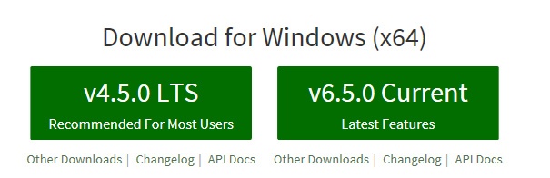
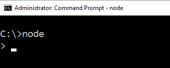
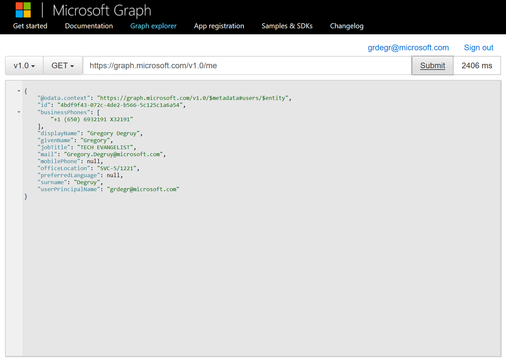

# Automating Office

We will address in this post:

- Outlook Add-In
	- Ribbon
		- Meeting Invite with custom tet
- OneDrive
	- Detect persons on shared documents
- Outlook Graph
	- Lookup information (name, contact info, pictures)

### Prerequisites

#### Install Node

[https://nodejs.org/en/](https://nodejs.org/en/)

_Figure 1: Installing Windows_

_Figure 2: Testing Node_

#### Install NPM

[http://t.umblr.com/redirect?z=http%3A%2F%2Fnodejs.org%2F&t=ZmM2MTQyYTgxMjg3ZDM1ZGU5MDI1YWQ0Yjc5OGU1MTU5MWIxMjYyMSxENW01czlHRg%3D%3D](http://t.umblr.com/redirect?z=http%3A%2F%2Fnodejs.org%2F&t=ZmM2MTQyYTgxMjg3ZDM1ZGU5MDI1YWQ0Yjc5OGU1MTU5MWIxMjYyMSxENW01czlHRg%3D%3D "Install NPM")

#### Install Office Generator

`npm install -g tsd bower gulp yo generator-office`	

[https://www.npmjs.com/package/generator-office ](https://www.npmjs.com/package/generator-office )

### Outlook Add-in

x

### OneDrive

- Connect app to OneDrive
	- x
	-
- Connect app to OneDrive for Business

### Outlook Graph

X

### Microsoft Graph
- REST call to return a list items shared with the signed-in user https://graph.microsoft.com/v1.0/me/drive/sharedWithMe
- Graph queries can be tested here: https://graph.microsoft.io/en-us/graph-explorer

_Figure x: Microsoft Graph Explorer_
