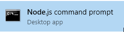
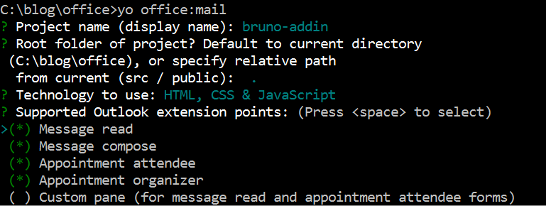
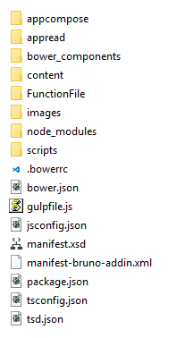
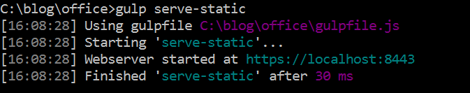
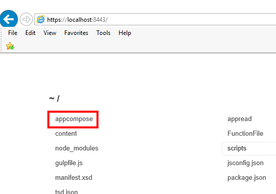
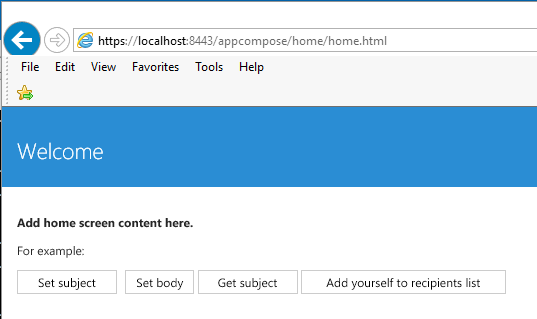

# Automating Office

We will address in this post:

- Outlook Add-In
	- Ribbon
		- Meeting Invite with custom tet
- OneDrive
	- Detect persons on shared documents
- Outlook Graph
	- Lookup information (name, contact info, pictures)

### Prerequisites

#### Install Node

[https://nodejs.org/en/](https://nodejs.org/en/)

_Figure 1: Installing Windows_

_Figure 2: Testing Node_

Run the command line as **administrator**.

_Figure 3: Running Node Command line_

#### Install Office Generator

This did not work well on Windows.

Installed a newer version of NPM as well as the rest of the packages:

    npm install npm -g
    npm install -g tsd bower gulp yo generator-office

On my system I had to install individually:
    
    npm install -g tsd
    npm install -g bower
    npm install -g yo
    npm install -g gulp
    npm install -g generator-office
    
[https://www.npmjs.com/package/generator-office ](https://www.npmjs.com/package/generator-office )

### Outlook Add-in

Now that we've got the prerequisites taken care of, let's turn our attention to the generator. We will use the generator to create a **Mail Add-In**. The generator will create a file called **gulpfile.js**. it will leverage an HTTPS server with a self signed SSL certificate, so that you can use and test your add-in from the command line.

We will now create the Outlook Mail Add-In.

_Figure 4: Accept all defaults_

Continue to hit "enter" and accept all defaults. When you are through, you will see this:

_Figure 5: The completed project files_

#### Start the gulp server

At the command line, type the following:

	gulp serve-static

_Figure 8: Start gulp server_

#### Navigate to http://localhost:8443

_Figure 9: Start a browser session_

Choose **appcompose**, then **home**, followed by **home.html.**

_Figure 10: Home screen for the session_

https://technet.microsoft.com/en-us/library/cc754841.aspx

### OneDrive

- Connect app to OneDrive
	- x
	-
- Connect app to OneDrive for Business

### Outlook Graph

X

### Microsoft Graph
- REST call to return a list items shared with the signed-in user https://graph.microsoft.com/v1.0/me/drive/sharedWithMe
- Graph queries can be tested here: https://graph.microsoft.io/en-us/graph-explorer

_Figure x: Microsoft Graph Explorer_

Publish in Office Store (browse in store and add)
Partner to talk to Office Store Team (follow process)

Gulp is oneway - some ability to serve web files
Can put on IIS on localmachine - just need a web server - Visual Studio 2015 (cassini)
Azure Web App - Upload 
Dialog API - Office 365 and for consumer users
