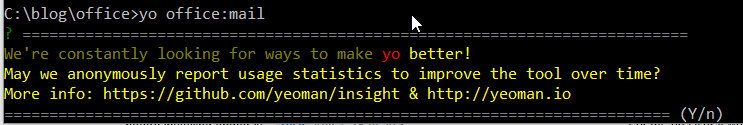
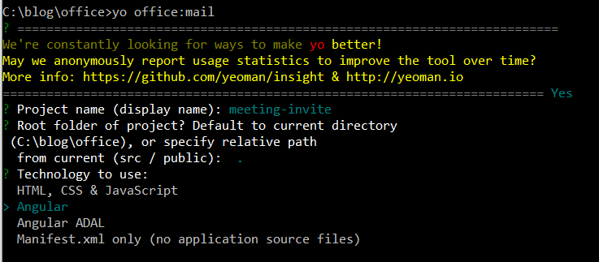

# Automating Office

We will address in this post:

- Outlook Add-In
	- Ribbon
		- Meeting Invite with custom tet
- OneDrive
	- Detect persons on shared documents
- Outlook Graph
	- Lookup information (name, contact info, pictures)

### Prerequisites

#### Install Node

[https://nodejs.org/en/](https://nodejs.org/en/)

_Figure 1: Installing Windows_

_Figure 2: Testing Node_

Run the command line as **administrator**.

_Figure 3: Running Node Command line_

#### Install Office Generator

This did not work well on Windows.

Installed a newer version of NPM as follows:

    npm install npm -g

    npm install -g tsd bower gulp yo generator-office

On my system I had to install individually:
    
    npm install -g tsd
    npm install -g bower
    npm install -g yo
    npm install -g generator-office
    

[https://www.npmjs.com/package/generator-office ](https://www.npmjs.com/package/generator-office )

### Outlook Add-in

Now that we've got the prerequisites taken care of, let's turn our attention to the generator. We will use the generator to create a **Mail Add-In**. The generator will create a file called **gulpfile.js**. it will leverage an HTTPS server with a self signed SSL certificate, so that you can use and test your add-in from the command line.

We will now create the Outlook Mail Add-In.

_Figure 4: _

We will use angular as the code base.

_Figure 5:  x_

Choose the default option by hitting enter for the remaining questions.

### OneDrive

- Connect app to OneDrive
	- x
	-
- Connect app to OneDrive for Business

### Outlook Graph

X

### Microsoft Graph
- REST call to return a list items shared with the signed-in user https://graph.microsoft.com/v1.0/me/drive/sharedWithMe
- Graph queries can be tested here: https://graph.microsoft.io/en-us/graph-explorer

_Figure x: Microsoft Graph Explorer_
