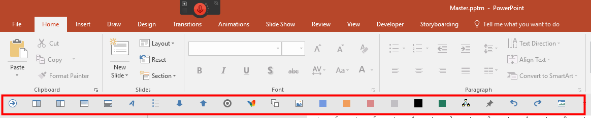

## Significant experience with Office automation

I have a significant library, of which only a portion is exposed here, that automates many facets of Office including:

- Custom toolbars used in PowerPoint
- VBA code that interacts with the Outlook calendar
- Node.js that demonstrates the use of an Outlook toolbar
- C# code that merges and manipulates PowerPoint files

*Again, this is a small fraction of the code I have*

### Custom toolbars used in PowerPoint

Below is a custom toolbar that does all sorts of manipulation of content, including adding of images, positioning of images, adding color boxes, and much more. Below is a few the code snippets.

	Sub AddTextBoxes(mode As String)
	    Dim start As Integer, amt As Integer
	    Dim shapestack_offset As Integer
	    
	    Dim MyData As DataObject
	    Dim ShapeList() As String
	
	    Dim strClip As String
	    Dim c As Long
	    Set MyData = New DataObject
	    MyData.GetFromClipboard
	    strClip = CStr(MyData.GetText)
	    Dim arr
	    arr = Split(strClip, vbCrLf)
	    Dim i As Integer
	    i = 1
	    Randomize
	    Dim lefts As Variant
	    Dim tops As Variant
	    lefts = Array(10, 210, 410, 610, 810)
	    tops = Array(10, 210, 410, 610, 810)
	    Dim mycolors As Variant
	
	    Dim row As Integer, col As Integer
	    Dim mycount As Integer
	    Dim l As Integer, t As Integer
	
	    colorstack_offset = 0
	    shapestack_offset = 0
	
	    colcount = 6
	    RowCount = 8
	    startleft = 0
	    starttop = 0
	    i = 1
	    For Each therow In arr
	        ' get to current slide
	        If Trim(therow) <> "" Then
	            mycount = mycount + 1
	            Dim myshape As Shape
	            Dim myshape2 As Shape
	            m_main_slide = ActiveWindow.Selection.SlideRange.SlideNumber
	            Set mySlide = ActivePresentation.slides(m_main_slide)
	
	
	            'calc the current row and column based on the total count
	            curr_col = (i - 1) Mod colcount
	            curr_row = Int((i - 1) / colcount)
	
	            i = i + 1
	            ' add 2 shapes, one for the box and one for the text
	            If mode = "code" Then
	                Set myshape2 = mySlide.Shapes.AddTextbox(msoTextOrientationHorizontal, startleft + (curr_col * 200), starttop + (curr_row * 100), 850, 30)
	                With myshape2.TextFrame
	                    .AutoSize = ppAutoSizeNone
	                    .VerticalAnchor = msoAnchorMiddle
	                    '.VerticalAnchor = msoAnchorTop
	                End With
	
	                ' add shape 2
	                Set shapestack(shapestack_offset) = myshape2
	                shapestack_offset = shapestack_offset + 1
	            ElseIf mode = "regularnested" Then  ' separate text field
	                Set myshape = mySlide.Shapes.AddTextbox(msoTextOrientationHorizontal, startleft + (curr_col * 200), starttop + (curr_row * 100), 200, 100)
	                ' format shape 1
	                FormatShape1 myshape
	                ' add shape 1
	                Set shapestack(shapestack_offset) = myshape
	                shapestack_offset = shapestack_offset + 1
	                
	                Set myshape2 = mySlide.Shapes.AddTextbox(msoTextOrientationHorizontal, startleft + (curr_col * 200), starttop + (curr_row * 100), 180, 100)
	                ' add shape 2
	                Set shapestack(shapestack_offset) = myshape2
	                shapestack_offset = shapestack_offset + 1
	            ElseIf mode = "regular" Then
	                Set myshape = mySlide.Shapes.AddTextbox(msoTextOrientationHorizontal, startleft + (curr_col * 200), starttop + (curr_row * 100), 200, 100)
	                ' format shape 1
	                FormatShape1 myshape
	                ' add shape 1
	                Set shapestack(shapestack_offset) = myshape
	                shapestack_offset = shapestack_offset + 1
	                
	                
	            ElseIf mode = "plain" Then
	                Set myshape2 = mySlide.Shapes.AddTextbox(msoTextOrientationHorizontal, startleft + (curr_col * 200), starttop + (curr_row * 100), 400, 30)
	                With myshape2.TextFrame
	                    .AutoSize = ppAutoSizeNone
	                    .VerticalAnchor = msoAnchorMiddle
	                    '.VerticalAnchor = msoAnchorTop
	                End With
	
	
	                ' add shape 2
	                Set shapestack(shapestack_offset) = myshape2
	                shapestack_offset = shapestack_offset + 1
	            End If
	            
	            'Debug.Print "assigned a top of " & myshape2.Top
	
	            Dim oTxtRng As TextRange
	            Select Case mode
	                Case "regular"
	                    therow = LTrim(RTrim(therow))
	                    therow = Replace(therow, vbTab, "")
	                    myshape.TextFrame.TextRange.Text = therow
	                    If myshape.TextFrame.HasText Then
	                        Set oTxtRng = myshape.TextFrame.TextRange
	                        For j = 1 To oTxtRng.Runs.Count
	                          With oTxtRng.Runs(j).Font
	                                .Color.RGB = RGB(255, 255, 255)
	                                .Size = 20
	                          End With
	                        Next j
	                    End If
	                Case "regularnested"
	                    therow = LTrim(RTrim(therow))
	                    therow = Replace(therow, vbTab, "")
	                    myshape2.TextFrame.TextRange.Text = therow
	                    If myshape2.TextFrame.HasText Then
	                        Set oTxtRng = myshape2.TextFrame.TextRange
	                        For j = 1 To oTxtRng.Runs.Count
	                          With oTxtRng.Runs(j).Font
	                                .Color.RGB = RGB(255, 255, 255)
	                                .Size = 20
	                          End With
	                        Next j
	                    End If
	                Case "plain"
	                    therow = LTrim(RTrim(therow))
	                    therow = Replace(therow, vbTab, "")
	                    myshape2.TextFrame.TextRange.Text = therow
	                    If myshape2.TextFrame.HasText Then
	                        Set oTxtRng = myshape2.TextFrame.TextRange
	                        For j = 1 To oTxtRng.Runs.Count
	                          With oTxtRng.Runs(j).Font
	                                .Name = "Segoe UI Light"
	                                .Color.RGB = RGB(255, 255, 255)
	                                .Size = 28
	                          End With
	                        Next j
	                        s = myshape2.TextFrame.TextRange.Text
	                        nbrchars = Len(s)
	                        'adjust ht based on char count
	                        If nbrchars > 90 Then
	                           myshape2.Height = 90
	                        ElseIf nbrchars > 50 Then
	                           myshape2.Height = 60
	                        Else
	                           myshape2.Height = 35
	                        End If
	                      ' anchor in middle
	                      myshape2.TextFrame.VerticalAnchor = msoAnchorMiddle
	                    End If
	                    
	                Case "code"
	                    therow = LTrim(RTrim(therow))
	                    therow = Replace(therow, vbTab, "")
	                    myshape2.TextFrame.TextRange.Text = "$  " & therow
	                    If myshape2.TextFrame.HasText Then
	                       Set oTxtRng = myshape2.TextFrame.TextRange
	                       For j = 1 To oTxtRng.Runs.Count
	                          With oTxtRng.Runs(j).Font
	                             .Color.RGB = RGB(255, 255, 255)
	                             .Size = 18
	                             .Name = "Consolas"
	                          End With
	                       Next j
	                    End If
	            End Select
	        End If
	    Next
	    
	    
	    'play with location here
	    'trying to space better, very hard
	    
	    Dim strShapes() As String
	    ReDim Preserve strShapes(0 To shapestack_offset) As String
	    Dim shprange As ShapeRange
	    For i = 0 To (shapestack_offset - 1)
	        strShapes(i) = shapestack(i).Name
	        Debug.Print "ht = " & shapestack(i).Height & vbCrLf & "top = " & shapestack(i).Top & vbCrLf & "------"
	    Next
	    Set shprange = mySlide.Shapes.Range(strShapes)
	    shprange.Select
	    For i = 0 To (shapestack_offset - 1)
	        totht = totht + shapestack(i).Height
	    Next
	    Debug.Print "totht = " & totht
	    totsp = (400 - totht) / shapestack_offset
	
	    shapestack(0).Top = 180
	    shapestack(0).Left = 60
	    Set shprange = mySlide.Shapes.Range(strShapes)
	    shprange.Select
	    For i = 1 To (shapestack_offset - 1)
	        shapestack(i).Left = 60
	        If mode = "regularnested" Then
	           If i Mod 2 = 1 Then
	              ' top should be the same as the one before
	              shapestack(i).Top = shapestack(i - 1).Top
	           Else
	               shapestack(i).Top = shapestack(i - 1).Top + (shapestack(i - 1).Height + 20)
	           End If
	        Else
	           shapestack(i).Top = shapestack(i - 1).Top + (shapestack(i - 1).Height + 20)
	        End If
	    Next
	
	    Set shprange = mySlide.Shapes.Range(strShapes)
	    shprange.Select
	    
	
	End Sub
	
	Sub AddBlueBox()
	    Call AddColoredBox(RGB(22, 25, 59))
	End Sub
	
	Sub AddGrayBox()
	    Call AddColoredBox(RGB(53, 71, 140))
	End Sub
	
	Sub AddBrightOrange()
	    Call AddColoredBox(RGB(230, 126, 212))
	End Sub
	
	Sub AddLightOrangeBox()
	    Call AddColoredBox(RGB(169, 173, 199))
	End Sub
	Sub AddDarkGreyBox()
	    Call AddColoredBox(RGB(240, 108, 65))
	End Sub
	Sub AddListhBlueBox()
	    Call AddColoredBox(RGB(173, 213, 247))
	End Sub
	Sub AddColoredBox(mycolor As Long)
	    Randomize
	    ActiveWindow.Selection.SlideRange.Shapes.AddShape(msoShapeRectangle, Rnd * 100, Rnd * 300, 300#, 200#).Select
	    ActiveWindow.Selection.ShapeRange.TextFrame.TextRange.Select
	    With ActiveWindow.Selection.TextRange.ParagraphFormat
	        .LineRuleWithin = msoTrue
	        .SpaceWithin = 1
	        .LineRuleBefore = msoTrue
	        .SpaceBefore = 0.5
	        .LineRuleAfter = msoTrue
	        .SpaceAfter = 0
	    
	    End With
	    ActiveWindow.Selection.ShapeRange.TextFrame.TextRange.Paragraphs(start:=1, Length:=1).ParagraphFormat.Alignment = ppAlignLeft
	
	   
	    With ActiveWindow.Selection.ShapeRange
	        .TextFrame.WordWrap = msoCTrue
	        .TextFrame.AutoSize = ppAutoSizeNone
	        .Fill.Solid
	        .Fill.ForeColor.RGB = mycolor
	        .Fill.BackColor.RGB = mycolor
	        .Line.Weight = 0#
	        .Line.Visible = msoFalse
	        'SHUT OFF FOR NOW
	        .ZOrder msoSendToBack
	    End With
	
	
	
	End Sub

_Figure 1: My Custom Toolbars_

### VBA code that interacts with the Outlook calendar

The code below is to automate the retrieval of my calendar.

The user interface to kick off macros.

_Figure 2: Excel interface_

The results:

_Figure 3: snap3.png_

	Sub GetMyCalendar()
	
	    Dim colFolders(0) As Outlook.Explorer
	    
	    Dim ws As Worksheet
	    Dim ws_group As Worksheet
	    Set ws = Worksheets("GGRooms")
	    'ws.Cells(2, c).Text
	    
	    Call GetMyFolders(colFolders)
	       
	    Call GetCalData(colFolders, CDate(ws.Cells(2, 3).Text), CDate(ws.Cells(2, 4).Text))
	    'Call test2(colFolders, ws.Cells(2, 3).Text, ws.Cells(2, 4).Text)
	    
	    
	    
	    'Call GetCalData(colFolders(1), "2/12/2013", "2/15/2013")
	
	End Sub
	
	Private Sub GetCalData(mycal() As Outlook.Explorer, StartDate As Date, Optional EndDate As Date)
	 
	    ' -------------------------------------------------
	    ' Notes:
	    ' If Outlook is not open, it still works, but much slower (~8 secs vs. 2 secs w/ Outlook open).
	    ' Make sure to reference the Outlook object library before running the code
	    ' End Date is optional, if you want to pull from only one day, use: Call GetCalData("7/14/2008")
	    ' -------------------------------------------------
	     
	    Dim olApp As Outlook.Application
	    Dim olNS As Outlook.Namespace
	    Dim myCalItems As Outlook.Items
	    Dim ItemstoCheck As Outlook.Items
	    Dim ThisAppt As Outlook.AppointmentItem
	     
	    Dim MyItem As Object
	     
	    Dim StringToCheck As String
	     
	    Dim MyBook As Excel.Workbook
	    Dim rngStart As Excel.Range
	     
	    Dim i As Long
	    Dim nextrow As Long
	     
	    ' if no end date was specified, then the requestor only wants one day, so set EndDate = StartDate
	    ' this will let us return appts from multiple dates, if the requestor does in fact set an appropriate end date
	    If EndDate = "12:00:00 AM" Then
	      EndDate = StartDate
	    End If
	     
	    If EndDate < StartDate Then
	      MsgBox "Those dates seem switched, please check them and try again.", vbInformation
	      GoTo ExitProc
	    End If
	     
	    If EndDate - StartDate > 28 Then
	      ' ask if the requestor wants so much info
	      If MsgBox("This could take some time. Continue anyway?", vbInformation + vbYesNo) = vbNo Then
	          GoTo ExitProc
	      End If
	    End If
	     
	     
	    On Error Resume Next
	      Set olApp = GetObject(, "Outlook.Application")
	      If Err.Number <> 0 Then
	        Set olApp = CreateObject("Outlook.Application")
	      End If
	    On Error GoTo 0
	    If olApp Is Nothing Then
	      MsgBox "Cannot start Outlook.", vbExclamation
	      GoTo ExitProc
	    End If
	     
	    Set MyBook = Excel.Workbooks.Add
	    Set rngStart = MyBook.Sheets(1).Range("A1")
	     
	     
	    Set olNS = olApp.GetNamespace("MAPI")
	    Dim theRoom As Variant
	
	    For Each theRoom In mycal
	    
	        Set myCalItems = olNS.GetFolderFromID(theRoom.CurrentFolder.EntryID).Items
	         
	        ' ------------------------------------------------------------------
	        ' the following code adapted from:
	        ' http://www.outlookcode.com/article.aspx?id=30
	        '
	        With myCalItems
	          .Sort "[Start]", False
	          .IncludeRecurrences = True
	        End With
	        '
	        StringToCheck = "[Start] >= " & Quote(StartDate & " 12:00 AM") & " AND [End] <= " & _
	          Quote(EndDate & " 11:59 PM")
	        Debug.Print StringToCheck
	        '
	        Set ItemstoCheck = myCalItems.Restrict(StringToCheck)
	        Debug.Print ItemstoCheck.Count
	        ' ------------------------------------------------------------------
	         
	        If ItemstoCheck.Count > 0 Then
	          ' we found at least one appt
	          ' check if there are actually any items in the collection, otherwise exit
	          If ItemstoCheck.Item(1) Is Nothing Then GoTo ExitProc
	         
	         
	          With rngStart
	            .Offset(0, 0).Value = "Subject"
	            .Offset(0, 1).Value = "Start Date"
	            .Offset(0, 2).Value = "DayOfWeek"
	            .Offset(0, 3).Value = "Start Time"
	            .Offset(0, 4).Value = "End Date"
	            .Offset(0, 5).Value = "End Time"
	            .Offset(0, 6).Value = "Location"
	            .Offset(0, 7).Value = "Categories"
	          End With
	         
	          For Each MyItem In ItemstoCheck
	            If MyItem.Class = olAppointment Then
	            ' MyItem is the appointment or meeting item we want,
	            ' set obj reference to it
	              Set ThisAppt = MyItem
	              nextrow = WorksheetFunction.CountA(Range("A:A"))
	         
	              With rngStart
	                .End(xlDown).End(xlUp).Offset(nextrow, 0).Value = ThisAppt.subject
	                .End(xlDown).End(xlUp).Offset(nextrow, 1).Value = Format(ThisAppt.Start, "MM/DD/YYYY")
	                .End(xlDown).End(xlUp).Offset(nextrow, 2).Value = Format(ThisAppt.Start, "dddd")
	                .End(xlDown).End(xlUp).Offset(nextrow, 3).Value = Format(ThisAppt.Start, "HH:MM AM/PM")
	                .End(xlDown).End(xlUp).Offset(nextrow, 4).Value = Format(ThisAppt.End, "MM/DD/YYYY")
	                .End(xlDown).End(xlUp).Offset(nextrow, 5).Value = Format(ThisAppt.End, "HH:MM AM/PM")
	                .End(xlDown).End(xlUp).Offset(nextrow, 6).Value = ThisAppt.Location
	         
	                If ThisAppt.Categories <> "" Then
	                  .End(xlDown).End(xlUp).Offset(nextrow, 7).Value = ThisAppt.Categories
	                Else
	                  .End(xlDown).End(xlUp).Offset(nextrow, 7).Value = "n/a"
	                End If
	              End With
	            End If
	          Next MyItem
	         
	          ' make it pretty
	          Call Cool_Colors(rngStart)
	          
	          MySort
	     
	        Else
	            MsgBox "There are no appointments or meetings during" & _
	              "the time you specified. Exiting now.", vbCritical
	        End If
	    
	    Next
	    
	     
	ExitProc:
	    Set myCalItems = Nothing
	    Set ItemstoCheck = Nothing
	    Set olNS = Nothing
	    Set olApp = Nothing
	    Set rngStart = Nothing
	    Set ThisAppt = Nothing
	End Sub

### Node.js that demonstrates the use of an Outlook toolbar

#### Install Node

[https://nodejs.org/en/](https://nodejs.org/en/)

_Figure 4: Installing Windows_

_Figure 5: Testing Node_

Run the command line as **administrator**.

_Figure 6: Running Node Command line_

#### Install Office Generator

This did not work well on Windows.

Installed a newer version of NPM as well as the rest of the packages:

    npm install npm -g
    npm install -g tsd bower gulp yo generator-office

On my system I had to install individually:
    
    npm install -g tsd
    npm install -g bower
    npm install -g yo
    npm install -g gulp
    npm install -g generator-office
    
[https://www.npmjs.com/package/generator-office ](https://www.npmjs.com/package/generator-office )

The following video was produced for customer to show how to create toolbars to be used in Outlook, both in the web product as well as the thick client:

https://1drv.ms/v/s!APs459J8dLeYjpRd

### C# code that merges and manipulates PowerPoint files

#### Printing Powerpoints

GUI to show printing of PowerPoints

_Figure 7: Print Powerpoints_

Code to print Powerpoint

_Figure 8: Office automation to print code_

Class to print Powerpoint

_Figure 9: Class to print Powerpoint_

#### Code to copy slides into MS Word

   private void cmdExportPPT_Click(object sender, EventArgs e)
    {
        m_PowerPointApp = new Ppt.ApplicationClass();
        InputBoxResult input = InputBox.Show("Enter file name", "PowerPoint", @"C:\blogs\090809\ppts\DevelopingForOffice.pptx");

        m_PowerPointSlides = m_PowerPointApp.Presentations.Open(input.Text,
            MsoTriState.msoTrue, MsoTriState.msoFalse, MsoTriState.msoFalse);

        if (Directory.Exists(@"c:\temp\test") == true)
            Directory.Delete(@"c:\temp\test", true);

        m_PowerPointSlides.SaveCopyAs(@"c:\temp\test",
            Microsoft.Office.Interop.PowerPoint.PpSaveAsFileType.ppSaveAsPNG, MsoTriState.msoTrue);

        m_WordApp = new Word.Application();
        m_WordApp.Visible = true;
        m_WordDoc = m_WordApp.Documents.Add(ref oMissing, ref oMissing,
            ref oMissing, ref oMissing);

        string[] theFiles = Directory.GetFiles(@"c:\temp\test");

        string[] dupeFiles = (string[]) theFiles.Clone();

        for (int j = 0; j < dupeFiles.Length; j++)
        {
            theFiles[j] = GetFileNameFromArray(dupeFiles, j + 1);
        }

        int i = 1;
        foreach (string fn in theFiles)
        {
            object anchor = m_WordApp.Selection.Range;
            m_WordApp.Selection.Font.Bold = 1;
            m_WordApp.Selection.EndKey(ref unit, ref nullobj);
            m_WordApp.Selection.TypeText(String.Format("Slide {0}", i++));
            m_WordApp.Selection.InsertParagraphAfter();
            m_WordApp.Selection.Font.Bold = 0;

            if (i == 27)
                i = 27;

            m_WordApp.Selection.InlineShapes.AddPicture(fn, ref oFalse, ref oTrue, ref anchor);
            m_WordApp.Selection.EndKey(ref unit, ref nullobj);

            m_WordApp.Selection.InsertParagraphAfter();
        }
        double targetheight = 800;
        double targetwidth = 600;
        foreach (Word.InlineShape s in m_WordDoc.InlineShapes)
        {
            double w = s.Width;
            double h = s.Height;
            double ratio = h / w;
            if(w / targetwidth > h / targetheight)
            {
                s.Width = (float)targetwidth;
                s.Height = (float)(targetwidth * ratio);
            }
            else
            {
                s.Height = (float)targetheight;
                s.Width = (float)(targetheight * 1.0 / ratio);
            }
    
        }

        ClosePPT();
        MessageBox.Show("Done !");

    }

#### Download PowerPoints

The code below performs downloads from HTTP endpoints.

	namespace BrunoDownloader 
	{ 
	    class Program 
	    { 
	        static HttpWebRequest webreq; 
	        static HttpWebResponse webresp; 
	        static FileStream fs; 
	        static BinaryWriter bw; 
	        static BinaryReader br = null; 
	
	        static string path = ""; 
	        static string download_folder = ""; 
	
	
	        static void Main(string[] args) 
	        { 
	            ServicePointManager.ServerCertificateValidationCallback 
	                = new RemoteCertificateValidationCallback(certExaminer); 
	
	            //string path = @"C:\devprojects\DownloadTechReady\DownloadTechReady\downloadlist.txt"; 
	
	            string target_filename, parent_folder; 
	            Uri uri; 
	            string theline; 
	
	            FileInfo fileinfo = new FileInfo(Environment.CurrentDirectory); 
	            path = fileinfo.Directory.Parent.FullName.ToString() + @"\downloadlist.txt"; 
	
	            download_folder = fileinfo.Directory.Parent.FullName; 
	            download_folder = @"c:\temp"; 
	
	
	            try 
	            { 
	
	                X509Certificate2 cert = null; 
	                ServicePointManager.ServerCertificateValidationCallback += ValidateRemoteCertificate; 
	
	                X509Store store = new X509Store(StoreLocation.LocalMachine); 
	                store.Open(OpenFlags.ReadOnly | OpenFlags.OpenExistingOnly); 
	                X509Certificate2Collection certcollection = (X509Certificate2Collection)store.Certificates; 
	                // pick a certificate from the store 
	                cert = X509Certificate2UI.SelectFromCollection(certcollection, 
	                        "Caption", 
	                        "Message", X509SelectionFlag.SingleSelection)[0]; 
	
	                store.Close(); 
	
	
	                if (File.Exists(path) == false) 
	                { 
	                    Console.WriteLine("cannot open " + path); 
	                    return; 
	                } 
	
	                StreamReader sw = new StreamReader(path); 
	                while (sw.EndOfStream == false) 
	                { 
	                    theline = sw.ReadLine().Trim(); 
	
	                    if (theline == null || theline == "") 
	                        break; 
	
	                    WebClient wc = new WebClient(); 
	
	                    uri = new Uri(theline); 
	
	                    int segments = uri.Segments.Length; 
	
	                    // I want the filename to include the parent folder 
	                    // Files might have the same name but differ by folder 
	                    // For example, zune/filename.wmv 
	                    //              big/filename.wmv 
	                    parent_folder = uri.Segments[segments - 2]; 
	                    parent_folder = parent_folder.Substring(0, parent_folder.Length - 1); 
	
	                    //target_filename = parent_folder + "_" + uri.Segments[segments - 1]; 
	                    target_filename = uri.Segments[segments - 1]; 
	
	                    //target_filename = "\\bruno.jpg"; 
	
	                    // theline holds the url 
	
	                    //theline = "http://www.istartedsomething.com/bingimages/#20091201-us"; 
	
	
	                    webreq = (HttpWebRequest)WebRequest.Create(theline); 
	
	
	                    webreq.Credentials = CredentialCache.DefaultCredentials; 
	                    if (cert != null) 
	                        webreq.ClientCertificates.Add(cert); 
	
	
	
	                    webreq.ContentType = "application/vnd.ms-powerpoint"; 
	
	                    //WebClient Client = new WebClient(); 
	                    //Client.DownloadFile(theline, target_filename); 
	
	
	
	
	                    // Set the response object 
	                    try 
	                    { 
	                        webresp = (HttpWebResponse)webreq.GetResponse(); 
	                    } 
	                    catch (Exception ex) 
	                    { 
	                        continue; 
	                    } 
	                     
	
	                    //Debug stuff 
	                    //Console.WriteLine(webresp.StatusCode); 
	                    //Console.WriteLine(webresp.Headers.ToString()); 
	
	                    // Prepare to read bytes from the response stream 
	                     
	                    long bytes_to_write = webresp.ContentLength; 
	
	                    // Check to make sure file does not exist with same length 
	                    // If exist, but different length, delete and re-write 
	                    // If exist, and similar length, skip file, already there 
	                    // If not exist, write file 
	
	
	
	                    if (File.Exists(download_folder + target_filename) == true) 
	                    { 
	
	                        // SKIP THIS FOR DIFFERENT SIZE 
	                        FileInfo fi = new FileInfo(download_folder + target_filename); 
	                        // Check for file size 
	                        if (fi.Length < bytes_to_write) 
	                        { 
	                            Console.WriteLine("\nDeleting and re-downloading " + download_folder + target_filename + "\n"); 
	                            File.Delete(download_folder + target_filename); 
	                        } 
	                        else 
	                        { 
	                            Console.WriteLine("\nAlready here so skipping " + download_folder + target_filename + "\n"); 
	                            webresp.Close(); 
	                            wc.Dispose(); 
	                            continue; 
	                        } 
	                    } 
	
	                    Console.WriteLine("\nDownloading now " + download_folder + target_filename + "\n"); 
	
	                    br = new BinaryReader(webresp.GetResponseStream()); 
	
	                    fs = new FileStream(download_folder + target_filename, FileMode.OpenOrCreate, FileAccess.Write); 
	
	                    bw = new BinaryWriter(fs); 
	                     
	
	                    int chunk_size = 2048; 
	                    long bytes_left = bytes_to_write; 
	                    long bytes_read = 0; 
	                    int i = 0; 
	                    double total_bytes_read = 0.0; 
	                    while (bytes_left != 0) 
	                    { 
	                        i = i + 1; 
	                        // request chunk size, then test to see what we got 
	                        byte[] byte_array = br.ReadBytes(Convert.ToInt32(chunk_size)); 
	                        bytes_read = byte_array.Length; 
	                        bw.Write(byte_array); 
	                        bytes_left -= bytes_read; 
	                        total_bytes_read += bytes_read; 
	                        if(i % 120 == 0) 
	                           Console.WriteLine(string.Format("MBytes read = {0:n3},  MBytes left = {1:n0}", total_bytes_read/1000000.0, bytes_left/1000000)); 
	                    } 
	                    // Check our status code 
	                    //Console.WriteLine(webresp.StatusCode); 
	                    bw.Flush(); 
	                    bw.Close(); 
	
	                    wc.Dispose(); 
	                } 
	                sw.Dispose(); 
	
	
	            } 
	            catch (WebException ex) 
	            { 
	                Console.WriteLine("Web Exception" + ex.Message); 
	                if (ex.Status == WebExceptionStatus.TrustFailure) 
	                { 
	                    // Code for handling security certificate problems goes here. 
	                    Console.WriteLine("Trust Failure " + ex.Message); 
	                } 
	            } 
	            catch (Exception ex) 
	            { 
	                Console.WriteLine(ex.Message); 
	                Console.WriteLine(ex.Message); 
	                bw.Flush(); 
	                bw.Close(); 
	            } 
	
	
	
	
	
	        } 
	
	        private static bool ValidateRemoteCertificate(object sender, X509Certificate certificate, X509Chain chain, SslPolicyErrors sslPolicyErrors) 
	        { 
	            // If the certificate is a valid, signed certificate, return true. 
	            if (sslPolicyErrors == System.Net.Security.SslPolicyErrors.None) 
	            { 
	                return true; 
	            } 
	
	            Console.WriteLine("X509Certificate [{0}] Policy Error: '{1}'", 
	                certificate.Subject, 
	                sslPolicyErrors.ToString()); 
	
	            return false; 
	
	        } 
	        static public bool certExaminer(object sender, X509Certificate c, X509Chain chain, SslPolicyErrors sllPolicyErrors) { 
	            return true;    //true means the certificate is okay to use 
	        } 
	
	    } 
	
	
	    class AcceptAllCertificatesPolicy : ICertificatePolicy 
	    { 
	        #region ICertificatePolicy Members 
	
	
	        public bool CheckValidationResult( 
	           ServicePoint srvPoint, 
	           System.Security.Cryptography.X509Certificates.X509Certificate certificate, 
	           WebRequest request, int certificateProblem) 
	        { 
	            // TODO:  Add AcceptAllCertificatesPolicy.CheckValidationResult 
	            // implementation 
	            return true; 
	        } 
	
	        #endregion 
	    } 
	
	} 

#### Code to merge Powerpoints

    var corefolder = @"c:\oreilly\javaazure\course1\" + chapterFolder; 
    var mergedPresentation = corefolder + "PptTemplate.pptx"; 

    List<string> pptxfiles = new List<string>(); 
    Regex regex = new Regex(@"\\\d\d\d\d\\"); 

    ///////////// Search for pptx files //////////////////// 

    FindFileExtension(corefolder, pptxfiles, ".pptx"); 
    pptxfiles.RemoveAll(str => pptxfiles.Any(s => str.Contains("~"))); 
    pptxfiles.RemoveAll(str => pptxfiles.Any(s => str.Contains("PptTemplate"))); 
    pptxfiles.RemoveAll(str => pptxfiles.Any(s => str.Contains("Total"))); 
    pptxfiles.Sort(); 

    // Now search for only files that have sections 
    var queryMatchingFiles = 
        from file in pptxfiles 
        let matches = regex.Matches(file) 
        where matches.Count > 0 
        select file; 
    pptxfiles = queryMatchingFiles.Cast<string>().ToList<string>(); 

    var n = DateTime.Now; 
    var tempDi = new DirectoryInfo(string.Format("ExampleOutput-{0:00}-{1:00}-{2:00}-{3:00}{4:00}{5:00}", n.Year - 2000, n.Month, n.Day, n.Hour, n.Minute, n.Second)); 
    tempDi.Create(); 

    // Open each file 
    StringBuilder sb = new StringBuilder(); 
    List<SlideSource> sources = new List<SlideSource>(); ; 
    foreach (var sourcePresentation in pptxfiles) 
    { 
        // MergeSlides(presentationFolder, sourcePresentation, mergedPresentation); 
        sources.Add(new SlideSource(new PmlDocument(sourcePresentation), true)); 
    } 
    PresentationBuilder.BuildPresentation(sources, Path.Combine(tempDi.FullName, "Out1.pptx")); 
    var pptApplication = new Microsoft.Office.Interop.PowerPoint.Application(); 
    Microsoft.Office.Interop.PowerPoint.Presentation presentation; 
    presentation = pptApplication.Presentations.Open(Path.Combine(tempDi.FullName, "Out1.pptx"), MsoTriState.msoFalse, MsoTriState.msoTrue); 

Leverages the work here:

https://github.com/OfficeDev/Open-Xml-PowerTools

### Code to extract all the text from a Powerpoint document

    Microsoft.Office.Interop.PowerPoint.Presentation presentation;
    Microsoft.Office.Interop.PowerPoint.Shape shape;
    Microsoft.Office.Interop.PowerPoint.Slide slide;

    List<string> pptxfiles = new List<string>();
    var corefolder = @"c:\some folder\";

    ///////////// Search for pptx files ////////////////////

    FindFileExtension(corefolder, pptxfiles, ".pptx");
    pptxfiles.RemoveAll(str => pptxfiles.Any(s => str.Contains("~")));
    pptxfiles.Sort();

    // Now search for only files that have sections
    var queryMatchingFiles =
        from file in pptxfiles
        let matches = regex.Matches(file)
        where matches.Count > 0
        select file;
    pptxfiles = queryMatchingFiles.Cast<string>().ToList<string>();

    // Process pptxfiles
    // Open each file
    StringBuilder sb = new StringBuilder();
    foreach (var item in pptxfiles)
    {
        var pptApplication = new Microsoft.Office.Interop.PowerPoint.Application();
        presentation = pptApplication.Presentations.Open(item, MsoTriState.msoFalse, MsoTriState.msoTrue);
        // grab first slide
        slide = presentation.Slides[1];
        // Grab text box
        int total_images = slide.Shapes.Count;
        string chapter = GetChapter(item);
        sb.Append(chapter + " - ");
        for (int i = 0; i < total_images; i++)
        {
            shape = slide.Shapes[i+1];
            if (shape.TextFrame.HasText == MsoTriState.msoTrue)
            {
                string s = shape.TextFrame.TextRange.Text;
                s = s.Replace((char)13, '-').Replace((char)11, '-');
                sb.Append(s);
            }
                
        }
        sb.AppendLine();
        // got text, so quit app
        ClosePresentation(ref pptApplication, ref presentation);
    }
    // Write all text
    System.IO.File.WriteAllText(@"c:\temp\test2.txt", sb.ToString());
